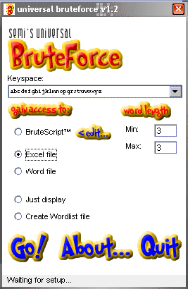



## Universal Bruteforce b1\.2

### Description

This is a complete BruteForcing tool that can recover passwords from both Excel and Word files, create word files and be customized to work on any other application using a simple scripting language.

You will have to install CodeSense OCX to make the program work (http://www.ticz.com/homes/users/nlewis/Menu.htm). This is the script editor being used for creating/modifying BruteScripts.

To Bruteforce Excel or Word files, Word or Excel are required.
 
### More Info
 

             |
---                |---
**Submitted On**   |2002-11-06 14:13:10
**By**             |[semi](https://github.com/Planet-Source-Code/PSCIndex/blob/master/ByAuthor/semi.md)
**Level**          |Intermediate
**User Rating**    |5.0 (10 globes from 2 users)
**Compatibility**  |VB 4\.0 \(32\-bit\), VB 5\.0, VB 6\.0
**Category**       |[Complete Applications](https://github.com/Planet-Source-Code/PSCIndex/blob/master/ByCategory/complete-applications__1-27.md)
**World**          |[Visual Basic](https://github.com/Planet-Source-Code/PSCIndex/blob/master/ByWorld/visual-basic.md)
**Archive File**   |[Universal\_14988511172002\.zip](https://github.com/Planet-Source-Code/semi-universal-bruteforce-b1-2__1-40804/archive/master.zip)

